# FocusCafe End-User Guide

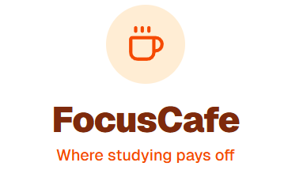

Welcome to the **FocusCafe** User Guide. This manual is designed to help students navigate the platform, manage their study sessions, generate AI-driven quizzes, and participate in collaborative study teams.

---

## 1. Authentication and Onboarding

The entry point of the application provides a flexible identity management system integrated via Supabase.

* **Standard Authentication:** Users can register an account by providing their First Name, Last Name, Email, and a secure password. Existing members can log in using their registered email credentials.
* **Google Single Sign-On (SSO):** For a faster onboarding experience, users can seamlessly sign up or log in using the **Sign in with Google** integration.

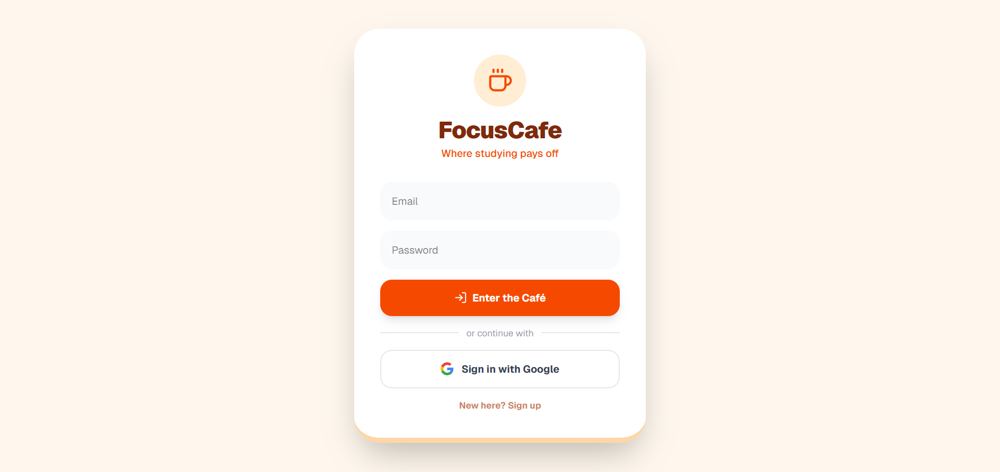
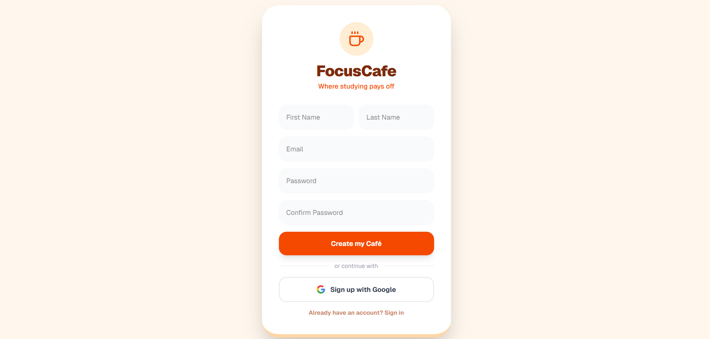

---

## 2. The Dashboard (Main Cafeteria Overview)

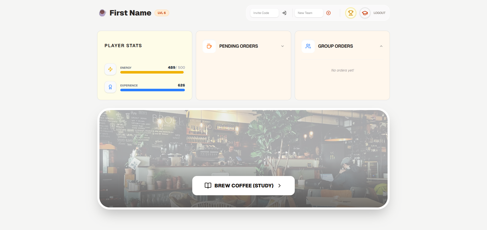

Once authenticated, users are redirected to the central workspace. The interface is broken down into intuitive diagnostic modules:

### 2.1. Top Navigation Control Bar

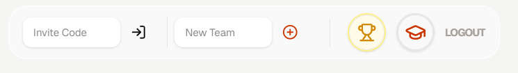

Located at the top right of the screen, the navigation cluster provides structural shortcuts (ordered from left to right):

1. **Team Workspace Entry:** Fields to input an *Invite Code* to join an existing group, or create a *New Team* instantly.

    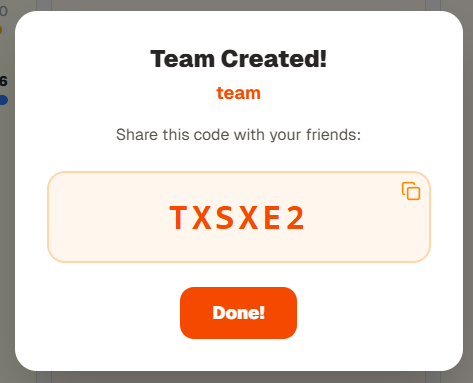

2. **Global Leaderboard (Trophy Icon):** Displays global student rankings based on accumulated experience points (XP).

    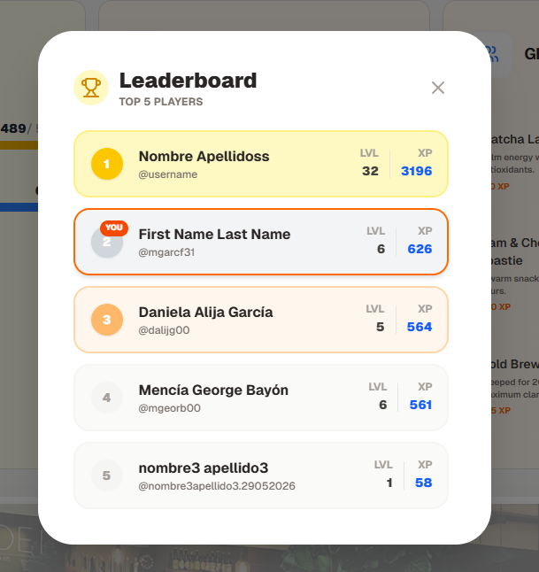

3. **User Profile (Graduation Cap Icon):** Accesses specialized personal telemetry, showing historical metadata such as the registration date (`Member Since`) and profile adjustments.

    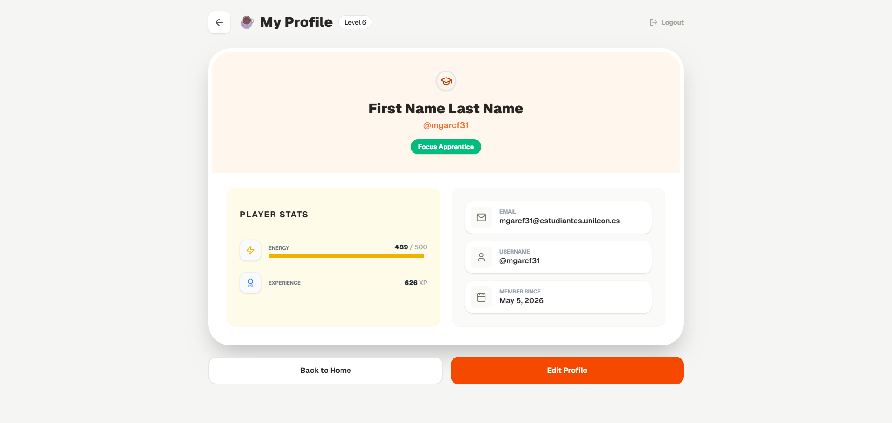
    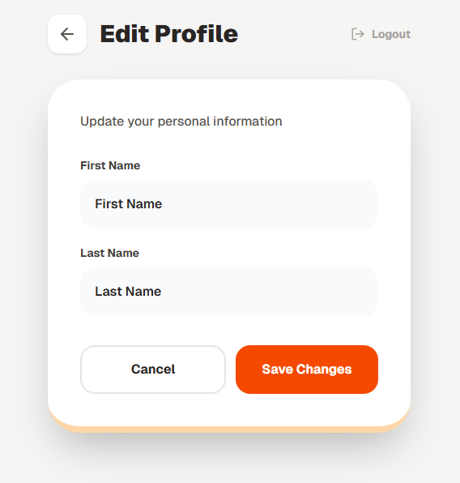

4. **Logout Button:** Securely destroys the local active session token.

### 2.2. Interactive Interface Cards

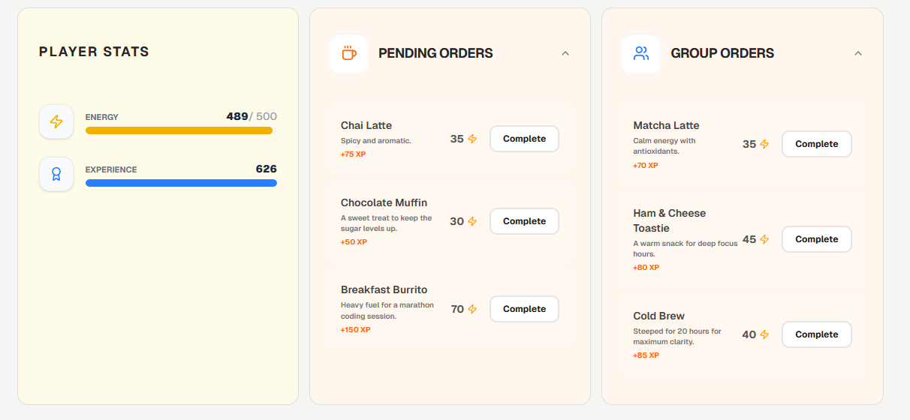

* **Player Stats:** Displays the user's current Progression Level, available **Energy** capacity, and absolute **Experience (XP)** points.

* **Pending Orders:** Individual gamification achievements that can be unlocked ("Completed") by spending focus energy to secure massive XP bonuses.

* **Group Orders:** Shared interactive orders. If a user belongs to a collaborative team, group objectives and synchronized orders appear here for collective progression.

---

## 3. Core Workflow: "Study & Brew" Session

The primary engine of the platform transforms study intervals into interactive milestones through the following linear flow:

### Step 1: Session Configuration

Clicking the **Brew Coffee (Study)** action button on the dashboard opens the deployment menu:

* **Material Upload:** A dedicated file attachment dropzone allows the user to upload an academic resource in **PDF format**.

* **Timer Selection:** A numerical configuration slot controls the focus runtime allocation in minutes (like the standard 25-minute Pomodoro setting).

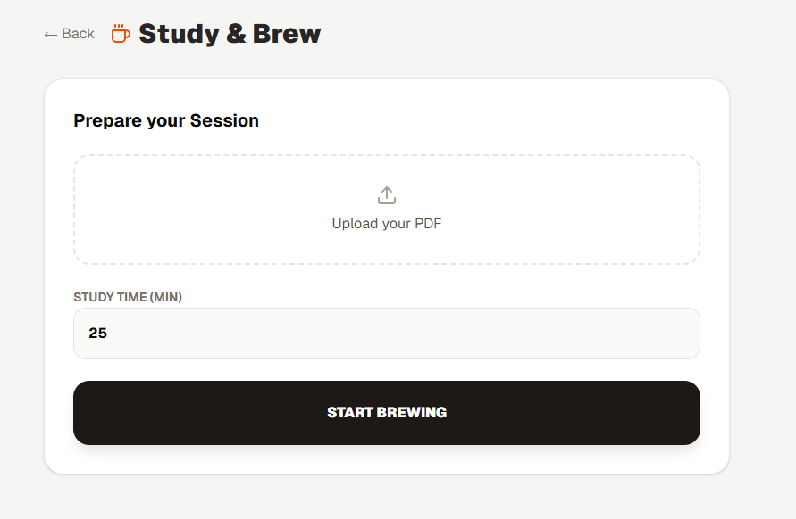

### Step 2: Active Focus Period

Clicking **Start Brewing** initiates a non-blocking fullscreen countdown timer. The engine extracts the text from the uploaded PDF document in the background while displaying motivational indicators (e.g., *"Brewing knowledge... stay focused!"*).

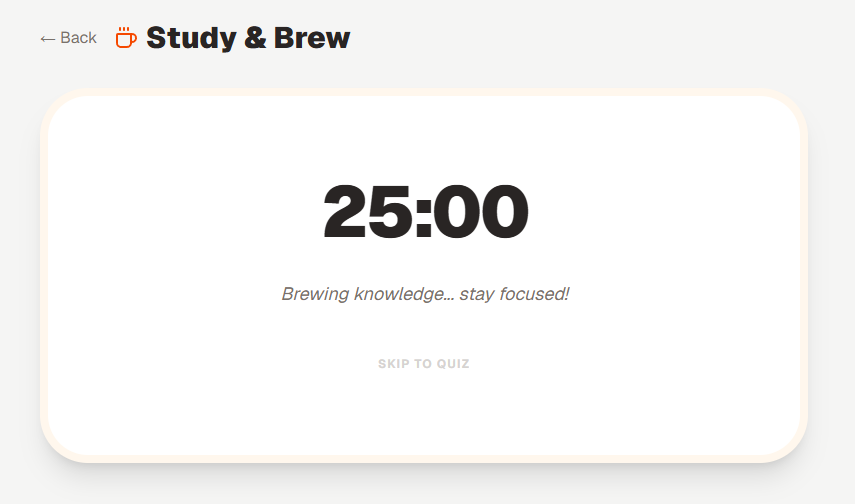

### Step 3: AI Quiz Generation & Evaluation

When the focus timer expires, the backend automatically forwards the document content to the **Google Gemini AI** engine. The interface renders a dynamic, multiple-choice questionnaire generated directly from the student's specific material.

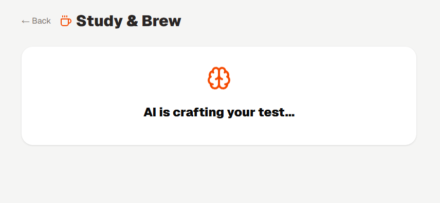
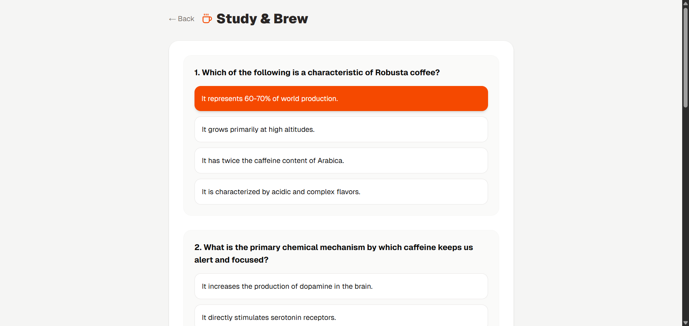
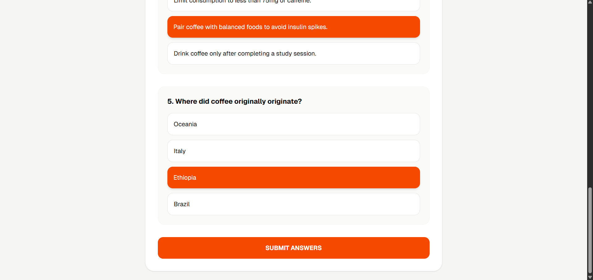

### Step 4: Performance Review and Rewards

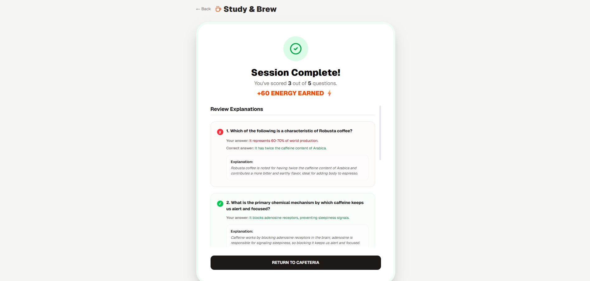

Upon clicking **Submit Answers**, the application processes the inputs and yields an analytical summary scorecard:

* **Reward Distribution:** Displays the final grade performance ratio (e.g., `1 out of 5 questions`) and adds the newly generated **Focus Energy points** straight to the student's wallet.

* **Granular Explanations:** Every question is displayed with explicit text indicators highlighting wrong choices, the correct response, and a rigorous contextual paragraph explaining *why* that answer is academically correct based on the source PDF material.

Clicking **Return to Cafeteria** synchronizes the profile metrics and safely redirects the student back to the updated central dashboard.

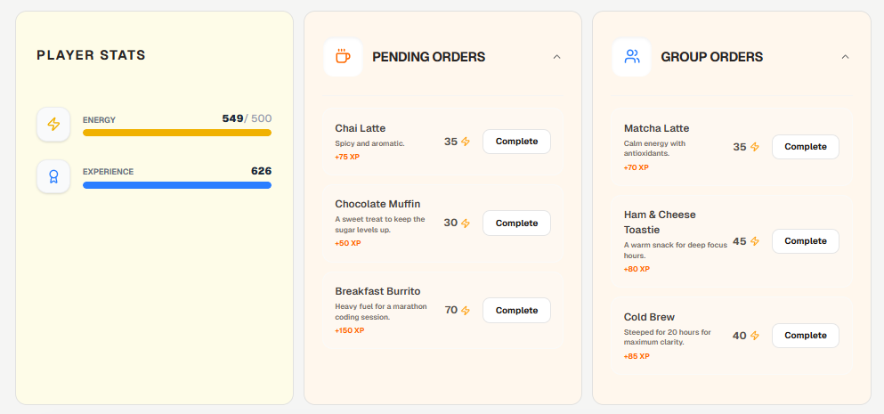
